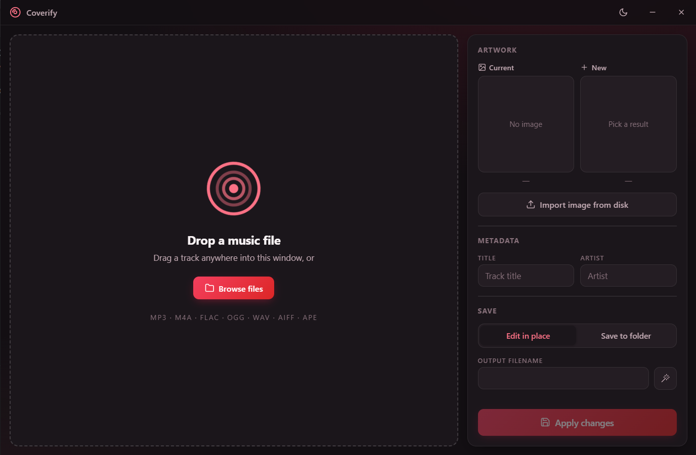

# CoverArtEditor

A desktop tool for editing music file cover art and metadata. Built with Tauri v2 (Rust backend + Vanilla JS frontend).



## Features

- **Drag & Drop** — Drop audio files and instantly view metadata
- **Metadata Editing** — Read/write title, artist, and cover art for MP3, M4A, FLAC, OGG, WAV, AIFF, APE
- **iTunes Album Art Search** — Search Apple's iTunes API for cover art with pagination
- **Side-by-Side Preview** — Compare current vs. selected cover art
- **In-Place & Save-to-Folder** — Edit files directly or save copies to a chosen folder
- **Dark/Light Theme** — Toggle between dark and light UI themes
- **Custom Image Import** — Import local image files (JPG, PNG, WebP, BMP) as cover art

## Tech Stack

| Layer       | Technology                          |
|-------------|-------------------------------------|
| Frontend    | HTML, Vanilla JS, CSS (dark/light)  |
| Desktop     | Tauri v2, Rust                      |
| Audio Tags  | lofty (Rust crate)                  |
| APIs        | Apple iTunes Search API             |
| HTTP        | reqwest (Rust crate)                |
| Icons       | Custom Node.js script (pngjs)       |

## Usage

```bash
# Development
npm install
npm run dev

# Production build
npm run build
```

The compiled binary will be in `src-tauri/target/release/coverify.exe`.

---

## فارسی

ویرایشگر کاور و متادیتای فایل‌های موسیقی — جستجو و دانلود کاور از iTunes + ویرایش برچسب‌های ID3

### قابلیت‌ها
- **کشیدن و رها کردن** — فایل صوتی را بکشید و متادیتا را ببینید
- **ویرایش متادیتا** — خواندن و نوشتن عنوان، هنرمند و کاور برای MP3, M4A, FLAC, OGG, WAV, AIFF, APE
- **جستجوی کاور** — جستجوی کاور آلبوم از API اپل iTunes
- **پیش‌نمایش کنار هم** — مقایسه کاور فعلی و جدید
- **ذخیره در محل یا پوشه** — ویرایش مستقیم فایل یا ذخیره کپی در پوشه دلخواه
- **حالت تاریک/روشن** — تغییر بین تم تیره و روشن
- **وارد کردن تصویر** — افزودن کاور دلخواه از فایل‌های JPG, PNG, WebP, BMP
